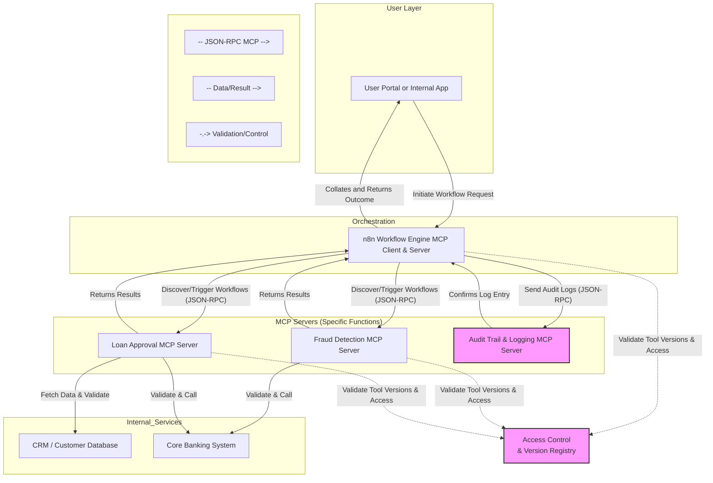

```mermaid
flowchart TD
    subgraph User Layer
        UI[User Portal or Internal App]
    end

    subgraph Orchestration
        n8n[n8n Workflow Engine MCP Client & Server]
    end

    subgraph MCP_Servers["MCP Servers (Specific Functions)"]
        Fraud[Fraud Detection MCP Server]
        Loan[Loan Approval MCP Server]
        Audit[Audit Trail & Logging MCP Server]
    end

    subgraph Internal_Services
        CRM[CRM / Customer Database]
        CoreBank[Core Banking System]
    end

    UI -- Initiate Workflow Request --> n8n
    n8n -- Discover/Trigger Workflows (JSON-RPC) --> Fraud
    n8n -- Discover/Trigger Workflows (JSON-RPC) --> Loan
    n8n -- Send Audit Logs (JSON-RPC) --> Audit

    Fraud -- Validate & Call --> CoreBank
    Loan -- Fetch Data & Validate --> CRM
    Loan -- Validate & Call --> CoreBank

    Fraud -- Returns Results --> n8n
    Loan -- Returns Results --> n8n
    Audit -- Confirms Log Entry --> n8n

    n8n -- Collates and Returns Outcome --> UI

    %% Security & Governance Layer
    policy[Access Control<br/>& Version Registry]
    n8n -.-> |Validate Tool Versions & Access| policy
    Fraud -.-> |Validate Tool Versions & Access| policy
    Loan -.-> |Validate Tool Versions & Access| policy

    %% Annotations
    classDef highlight fill:#f9f,stroke:#333,stroke-width:2px;
    Audit:::highlight
    policy:::highlight

    %% Legend/Key
    subgraph Legend[ ]
      direction LR
      key1[-- JSON-RPC MCP -->]
      key2[-- Data/Result -->]
      key3[-.-> Validation/Control]
    end
```