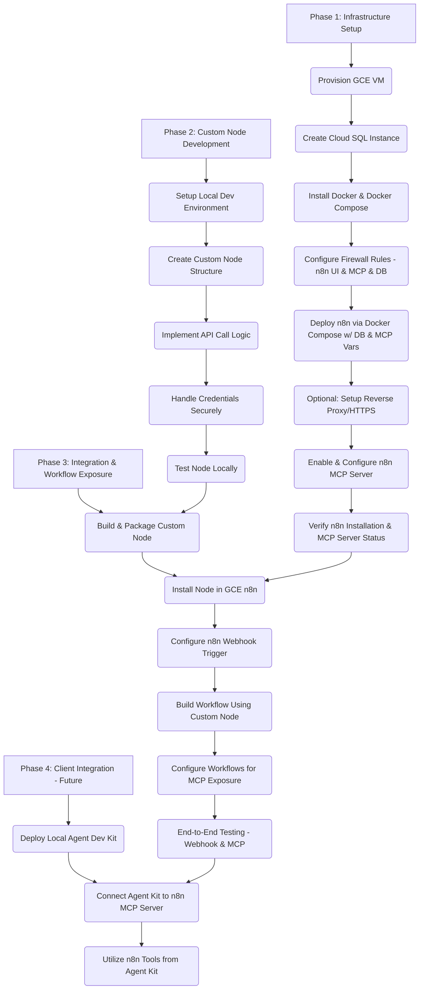

# n8n Deployment and Integration Plan (GCE, Cloud SQL, Custom Node, MCP Server)

## Project Goals

1.  Deploy a self-hosted n8n instance on Google Compute Engine (GCE).
2.  Configure the n8n instance to act as an MCP Server.
3.  Develop a custom n8n node to interact with an external Agentic AI API.
4.  Utilize n8n's webhook capabilities to trigger workflows that use this custom node.
5.  Expose selected n8n workflows (potentially including the one with the custom node) as tools via the MCP Server.
6.  (Future) Integrate with a local agent development kit connecting to the n8n MCP Server.

## High-Level Plan



## Detailed Steps

### Phase 1: Infrastructure Setup (GCE, Cloud SQL & n8n + MCP Server)

1.  **Provision GCE VM Instance:**
    *   Choose an appropriate machine type (e.g., `e2-small` or `e2-medium`).
    *   Select a region/zone.
    *   Choose an OS image (e.g., Debian or Ubuntu LTS).
    *   Configure basic disk settings.
2.  **Create Cloud SQL for PostgreSQL Instance:**
    *   Navigate to Cloud SQL in the GCP Console.
    *   Click "Create Instance" and choose "PostgreSQL".
    *   Provide an **Instance ID** (e.g., `n8n-postgres-db`).
    *   Set a strong **password** for the default `postgres` user (record securely).
    *   Choose a compatible **Database version**.
    *   Select the **Region** and **Zone** (ideally same region as GCE VM).
    *   Configure **Machine Type** (e.g., `db-f1-micro` or `db-g1-small`).
    *   Configure **Storage** (SSD recommended).
    *   **Connectivity:** Select **Private IP**, choose the correct VPC network, and note the assigned **Private IP address**.
    *   Click "Create Instance".
3.  **Create n8n Database and User:**
    *   Connect to the running Cloud SQL instance (e.g., via Cloud Shell).
    *   Connect as the `postgres` user.
    *   Execute SQL:
        ```sql
        CREATE DATABASE n8n_database;
        CREATE USER n8n_user WITH PASSWORD 'YourSecureN8nDbPassword'; -- Replace password!
        GRANT ALL PRIVILEGES ON DATABASE n8n_database TO n8n_user;
        \q
        ```
    *   Record database name, user, and password securely.
4.  **Install Docker & Docker Compose on GCE VM:**
    *   SSH into the VM.
    *   Follow official Docker documentation.
5.  **Configure Firewall Rules:**
    *   **GCP VPC Firewall:**
        *   Allow **ingress** to GCE VM: n8n UI/API port (e.g., 5678 or 80/443), n8n MCP port (e.g., 5679), SSH (22).
        *   Allow **egress** from GCE VM to Cloud SQL Private IP on PostgreSQL port (TCP 5432).
6.  **Deploy n8n using Docker Compose (with PostgreSQL & MCP Config):**
    *   On GCE VM, create/edit `docker-compose.yml`:
        ```yaml
        version: '3.7'

        services:
          n8n:
            image: n8nio/n8n
            restart: always
            ports:
              - "5678:5678" # n8n UI/API port
              - "5679:5679" # Example: MCP port (Verify!)
            environment:
              - GENERIC_TIMEZONE=Asia/Hong_Kong
              - N8N_ENCRYPTION_KEY=YourSecretEncryptionKeyHere # Generate & store securely!

              # --- PostgreSQL Configuration ---
              - DB_TYPE=postgresdb
              - DB_POSTGRESDB_HOST=Your_Cloud_SQL_Private_IP_Address # Replace!
              - DB_POSTGRESDB_PORT=5432
              - DB_POSTGRESDB_DATABASE=n8n_database
              - DB_POSTGRESDB_USER=n8n_user
              - DB_POSTGRESDB_PASSWORD=YourSecureN8nDbPassword # Replace!
              # Optional: Add DB_POSTGRESDB_SSL_* variables if needed

              # --- MCP Server Configuration (Check n8n docs for actual vars!) ---
              - N8N_MCP_SERVER_ENABLED=true # Hypothetical
              - N8N_MCP_SERVER_PORT=5679    # Hypothetical (Ensure matches 'ports')
              - N8N_MCP_SERVER_API_KEY=YourSecureMCPAPIKey # Hypothetical

            volumes:
              - n8n_data:/home/node/.n8n

        volumes:
          n8n_data:
        ```
    *   **Replace placeholders** and **verify MCP variable names** from n8n docs.
    *   Run `docker-compose up -d`.
7.  **(Optional but Recommended) Configure Reverse Proxy & HTTPS:**
    *   Install Nginx on GCE VM.
    *   Configure Nginx as reverse proxy for port 5678 (and potentially MCP port).
    *   Use Certbot for SSL certificates.
8.  **Enable & Configure n8n MCP Server:**
    *   Check n8n UI settings for any additional MCP configuration needed after startup.
9.  **Verify n8n Installation & Basic MCP Server Status:**
    *   Access n8n UI.
    *   Check `docker-compose logs n8n` for DB connection and MCP server start messages.

### Phase 2: Custom n8n Node Development

1.  **Set up Local n8n Development Environment:**
    *   Clone `n8n-nodes-starter` or follow n8n docs.
    *   Install Node.js, npm/yarn.
    *   Link node into local n8n instance (`npm link`).
2.  **Create Custom Node Structure:**
    *   Define node properties (name, icon, inputs, outputs, credentials).
    *   Create necessary files (`*.node.ts`, etc.).
3.  **Implement API Call Logic:**
    *   Write TypeScript code in `execute` method to call the external Agentic AI API.
    *   Handle inputs, credentials, API responses (success/error), and format output.
4.  **Handle Credentials Securely:**
    *   Define a new n8n credential type for the external API key.
    *   Access credentials securely using n8n methods.
5.  **Test Node Locally:**
    *   Run local n8n instance.
    *   Create test workflows using the new node.

### Phase 3: Integration, Workflow & MCP Exposure

1.  **Build & Package Custom Node:**
    *   Compile TypeScript (`npm run build`).
    *   Package node (npm publish or pack).
2.  **Install Node in GCE n8n Instance:**
    *   Connect to GCE VM.
    *   Install node into running n8n (method depends on setup - npm install in container, volume mount, custom image). Restart n8n if needed.
3.  **Configure n8n Webhook Trigger:**
    *   Create workflow, add `Webhook` trigger node, note Test/Production URLs.
4.  **Build Workflow(s) Using Custom Node:**
    *   Add custom node after trigger, configure credentials and input mapping.
5.  **Configure Specific Workflows for MCP Exposure:**
    *   In n8n UI, go to workflow settings or MCP section.
    *   Mark workflow as MCP tool.
    *   Define tool name, description, input schema, output schema.
6.  **End-to-End Testing:**
    *   Test webhook trigger pathway.
    *   Test MCP pathway using an MCP client (or `curl`) to call the exposed tool via the MCP endpoint.

### Phase 4: Client Integration (Future)

1.  Deploy Local Agent Development Kit (Google).
2.  Configure Agent Kit to connect to n8n MCP Server (URL, port, API key).
3.  Utilize exposed n8n workflow tools from the agent environment.

---
*Remember to consult official n8n documentation for specific environment variables, configuration steps, and best practices, especially regarding MCP server setup and security.*